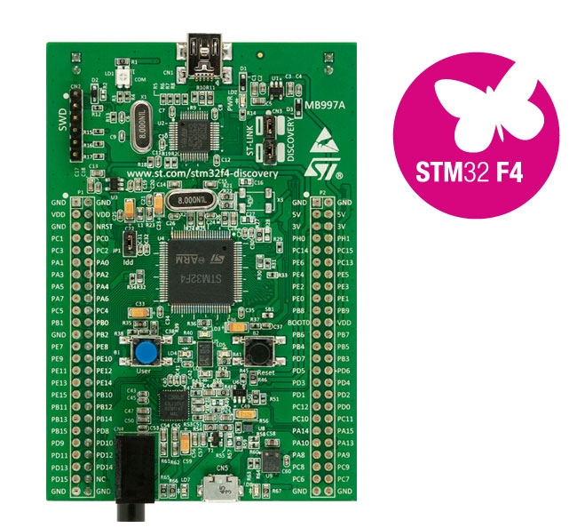

# STM32F4Discovery Tutorial 1 - LEDs Blinking

The first program every programmer learns consists in writing enough code to make their code show 
the sentence "Hello World!" on a screen. The blinking LED is the "Hello World!" of physical computing.

## Used HW

